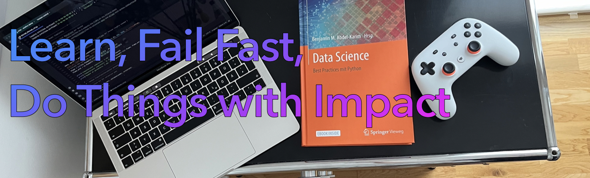
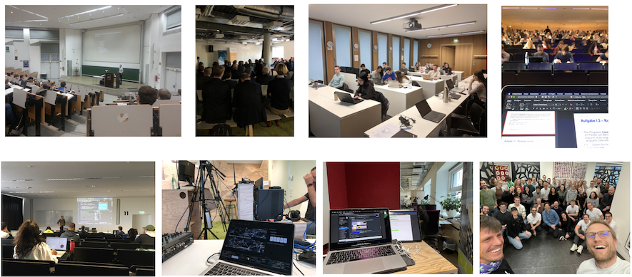

# Project and Side Hustle Overview
This GitHub page serves as a historical archive of my side hustle, reflecting my passion and the motivation behind these projects. It provides an overview of my work and the driving forces that inspire me.

### Flag Ship Project - Smart-Check In: Automated Customer Check-In Platform (Sommer 2024)
I developed an automated solution for a customer check-in platform that streamlines the registration process. Using a mobile phone to scan a QR code, customers can complete their check-in seamlessly in just a few steps. This solution ensures:

Quick and hassle-free registration:
- Optimized customer experience
- Integration-ready design for diverse industries
- The platform is built with a focus on user-friendliness, efficiency, and scalability, making it ideal for businesses looking to modernize their check-in processes.

****
- 2024 MIMIR - Making Cloud GPU Computing Affordable & Accessible To All:  I concluded a startup in the area of graphic power architecture and customer journey with a focus on interface design, aiming to offer GPU computing power via a marketplace in the B2B sector. Unfortunately, the founding team arround Lucas Schmitt, decided to cease operations due to challenges in the compensation landscape within the GPU market.

- 2024 RetireDoc: This startup offered a simple, device-independent documentation solution with a modern design. It provided a standardized platform for storing and managing documents, ensuring state-of-the-art data encryption for security. The data servers were located in Germany, guaranteeing compliance with local regulations. The service ensured reliability through redundancy, making it a trustworthy option for users. With a paper-free approach, it supported sustainable documentation practices. Additionally, the platform was cost-effective compared to other providers on the market and utilized in-house AI for enhanced efficiency. Users could migrate their current documentation—whether paper-based or digital—quickly and at no cost. The tech stack was based on Python, PyTorch, Flask, SQL, Amazon AWS, and Docker. Further development of the project was canceled due to the need to comply with medical regulatory requirements.
  
- 2022 Tomorrow's AfterMe: The goal of Tomorrow's AfterMe was to provide digital cloud storage for important documents and memories to share post-mortem with family. Due to challenges with German regulations and privacy, the project’s minimal viable product (MVP) was no longer developed. The tech stack was built on Microsoft Azure cloud services.

- 2022 - Tomorrow's Therapy: A platform that was meant to provide all services, similar to Booking.com, for booking medical appointments. This project was not sustainable due to high server costs. The tech stack included Python Flask, HTML, JavaScript, and other web technologies.

- 2020 - 2021 ePitches: At an early-stage startup, the goal was to optimize the job application process using a video-based platform. Applicants were encouraged to use a pitch format to introduce themselves. The project utilized Amazon AWS, Python, Docker, and SQL but was ultimately discontinued due to a lack of demand.

- 2020 Tech Hippo is a learning platform based on different services. The goal of this side hustle was to develop an Apple Store app. To achieve this, a client-server architecture was created to connect the app via API to the server and provide services through a user interface with an enhanced experience. Various technologies were used, including Apple Xcode, Python, and SQL. The application was sold.

****

### Transcript of Records - Side Hustle

## Advancing Data Science and Coding: My Contributions Through Published Works
I' am the author of several published works focusing on data, the evolving data landscape, and coding methodologies. My publications delve into topics ranging from data democratization and access, to the application of advanced coding techniques in real-world scenarios. These books, available through platforms such as Springer Link, aim to bridge the gap between theory and practical implementation, providing valuable insights for both researchers and practitioners. Through these contributions, I strive to advance the field of data science and foster innovation within the broader data and technology ecosystem.

[Abdel-Karim, B. M., & Kollmer, F. X. (Eds.). (2022). Sustainable finance: Herausforderungen und technologische Lösungen für Banken und Finanzdienstleister. Springer Fachmedien Wiesbaden GmbH.](https://link.springer.com/book/10.1007/978-3-658-36389-5)

[Abdel-Karim, B. M., (2022). Data Science: Best Practices mit Python. B. M. Abdel-Karim (Ed.). Springer Vieweg.](https://link.springer.com/book/10.1007/978-3-658-33460-4)

[Varmaz, A., Poddig, T., Fieberg, C., Abdel-Karim, B. M., (2020). MATLAB für Studierende und Professionals der Sozial- und Wirtschaftswissenschaften](https://www.amazon.de/MATLAB-Studierende-Professionals-Sozial-Wirtschaftswissenschaften/dp/3752630167)

## Empowering Innovation Through Knowledge Sharing and Technology Leadership
As a passionate advocate for knowledge sharing, I have served as a guest professor, lecturer, and mentor for several universities and startup incubators. My mission is to inspire the next generation of innovators by sharing insights on Data Science, Software Engineering, and leveraging technology to extract actionable knowledge from data.

As example, one of my projects focused on identifying forest fires using modern technologies, specifically through machine learning models in the area of image recognition. This work leveraged a robust dataset of satellite images, enabling the detection and prediction of forest fires with improved accuracy and speed. By applying advanced image recognition techniques, the project contributed to enhancing early warning systems and supporting efforts to mitigate environmental and economic damage caused by wildfires.

In addition to teaching and mentoring, I actively contribute to shaping the future of science and technology by serving on various advisory boards. My focus lies in fostering impactful innovation and guiding organizations on the strategic integration of emerging technologies.

### Transcript of Records - Teaching Experience

Teaching Experience at Frankfurt School of Fiance
- 2024: Elective in Advanced Analytics in Practice - How to Leverage Customer Data in Financial Institutions, for Prof. Dr. Jochen Schlapp,  $\approx$ 120 B.Sc. participants.

[Teaching Experience at University of Applied Sciences Heilbronn](https://www.hs-heilbronn.de/en)
- 2021 - 2022: Lecture in Business Data Analysis, for Prof. Dr. Carsten Lanquillon, $\approx$ 30 B.Sc. participants.
- 2020 - 2022: Lecture in Data Science Management, for Prof. Dr. Helmut Beckmann, $\approx$ 20 M.Sc. participants.

[Teaching Experience at University of Applied Sciences Ansbach](https://www.hs-ansbach.de/startseite/)
- 2021 - 2022: Lecture in Applied Machine Learning, Prof. Dr. Sigurd Schacht, $\approx$ 30 B.Sc. participants.

[Teaching Experience at Goethe University Frankfurt](https://www.wiim.uni-frankfurt.de/startseite/)
- 2019 - 2024: Lecture in Python for Data Science, for the e-finance Lab e.V. (Frankfurt am Main). 
- 2019 - 2024: Lecture in Introduction to Python for the e-finance Lab e.V. (Frankfurt am Main). 
- 2019 - 2021: Lecture\Exercise in Social Network Analysis, for Prof. Hinz, $\approx$ 280 M.Sc. participants. 
- 2018 - 2021: Seminar in Air Traffic, with Dr. Zieschang $\approx$ 20 M.Sc. participants, Best Seminar - Teaching Award 1$^{st$ place (2020). 
- 2018 - 2021: Tutorium in Information Systems II, for Prof. Hinz, $\approx$ 180-220 B.Sc. participants. 

[Teaching Experience at University Bremen](https://www.uni-bremen.de/en/)
- 2015 - 2016: Mentorium in Scientific Research Methods, for Prof. Varmaz, $\approx$ 20 M.Sc. participants. 
- 2016 Spring:  Mentorium in Scientific Research Methods, for Prof. Varmaz, $\approx$ 20 M.Sc. participants. 
- 2015 Fall: Tutorium in Finance, for Prof. Fieberg, $\approx$ 320 B.Sc. participants. 
- 2014 - 2015: Tutorium Corporate Finance, for Prof. Varmaz, $\approx$ 30 B.Sc. participants.  

### Transcript of Records - Speaker Requests/ Mentor Request/ Reviewer Request
- 2021: Associate Editor for International Conference on Information Systems (ICIS) 2021. 
- 2020: Speaker for Management and new Technology, for Capgemini SA, $\approx$ 10 M.Sc. participants. 
- 2018 - 2024: Lecture\ Challenge Owner: Machine Learning \& Deep Learning, Data Products, and Data Science for Management, for Tomorrows University $\approx$ 15 M.Sc. participants. 
- 2018: Speaker for Artificial Neuronal Networks Using Social Network for Forcasting (Frankfurt am Main).

### Research Publikationen (Peer-Reviewed)
- Abdel-Karim, Benjamin M. / Pfeuffer, Nicolas / Carl, K. Valerie / Hinz, Oliver (2023): "How AI-Based Systems Can Induce Reflections: The Case of AI-Augmented Diagnostic Work", Management Information Systems Quarterly (MISQ), 47(4), 1395-1424. doi.org/10.25300/MISQ/2022/16773

- Grahl, Jörn / Rothlauf, Franz / Hinz, Oliver / Abdel-Karim, Benjamin / Mihale-Wilson, Cristina (2023): "How do Likes Influence Revenue? A Randomized Controlled Field Experiment", Journal of Business Research, 167, 114133.

- Pfeuffer, Nicolas / Baum, Lorenz / Stammer, Wolfgang / Abdel-Karim, Benjamin M. / Schramowski, Patrick / Bucher, Andreas M. / Hügel, Christian / Rohde, Gernot / Kersting, Kristian / Hinz, Oliver (2023): “Explanatory Interactive Machine Learning: Establishing an Action Design Research Process for Machine Learning Projects”, Business & Information Systems Engineering 65, 677–701. doi.org/10.1007/s12599-023-00806-x

- Keller, Katharina / Jöntgen, Hendrik / Abdel-Karim, Benjamin / Hinz, Oliver (2022): "User Cognition Antecedents of Smart Assistant Systems in Cars", IEEE Transactions on Intelligent Transportation Systems, doi: 10.1109/TITS.2022.3216029, 24(1), 37-53.

- Kremer, Patrick / Felka, Patrick / Abdel-Karim, Benjamin / Kim, Ju-Young / Hinz, Oliver (2021): “Emotions Don’t Lie: Introducing an Artificial Intelligence Tool to Measure Ad Effectiveness”, European Marketing Academy Conference (EMAC), Madrid.

- Abdel-Karim, Benjamin M. / Benlian, Alexander / Hinz, Oliver (2021): "Predictive Value of Data From Virtual Investment Community", Machine Learning and Knowledge Extraction, 3 (1), 1-13.

- Hinz, Oliver / Pfeuffer, Nicolas / Stammer, Wolfgang / Schramowski, Patrick / Abdel-Karim, Benjamin M. / Bucher, Andreas / Hügel, Christian / Rohde, Gernot / Kersting, Kristian (2021) "Insights from Explainable Interactive Machine Learning in the Age of COVID-19", efl Insights (1) 2021, 06-08.

- Abdel-Karim, Benjamin M. / Pfeuffer, Nicolas / Hinz, Oliver (2021): "Machine Learning in Information Systems Research - A Bibliographic Review and Open Research Issues", Electronic Markets, 31, 643-670.

- Abdel-Karim, Benjamin M. / Keller, Katharina / Franzmann, Daniel (2020): "The Rise of Information System Research: A Big Picture based on Social Network Analysis over Four Decades", European Conference on Information Systems (ECIS 2020), Marrakech, Morocco.

- Wenzel, Mike / Chun, Felix K.-H. / Hinz, Oliver / Abdel-Karim, Benjamin M. (2020): "Potential of Automated Evaluation of Chest X-rays by Artificial Intelligence for Clinic and Practice", Der Pneumologe, 14 (1), 1-5.

- Abdel-Karim, Benjamin M. / Pfeuffer, Nicolas / Rohde Gernot / Hinz, Oliver (2020): "How and what can Humans Learn from being in the Loop? Invoking Contradiction Learning as a Measure to Make Humans Smarter", German Journal on Artificial Intelligence, 34 (2), 199-207.

- Keller, Katharina / Carl, Kim Valerie / Jöntgen, Hendrik / Abdel-Karim, Benjamin M. / Mühlhäuser, Max / Hinz, Oliver (2019): "K.I.T.T., where are you?" - Why Smart Assistance Systems in Cars enrich People's Lives", International Workshop on Ubiquitous Personal Assistance (UPA 2019 at UbiComp 2019) (Best Paper Award). doi.org/10.1145/3341162.3350844

- Abdel-Karim, Benjamin M. (2020): "Beautiful Fractals as a Crystal Ball for Financial Markets? - Investment Decision Support System Based on Image Recognition Using Artificial Intelligence", The Journal of Prediction Markets: Accept.

