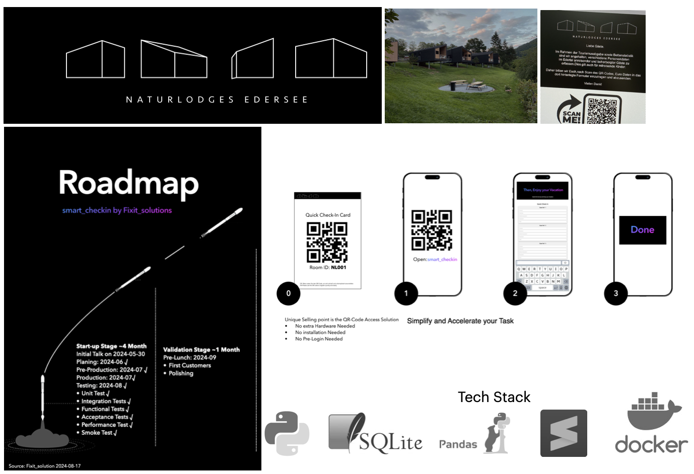

# Project and Side Hustle Overview
This GitHub page serves as a historical archive of my side hustle, reflecting my passion and the motivation behind these projects. It provides an overview of my work and the driving forces that inspire me.

# Smart-Check In: Automated Customer Check-In Platform (Sommer 2024)
I developed an automated solution for a customer check-in platform that streamlines the registration process. Using a mobile phone to scan a QR code, customers can complete their check-in seamlessly in just a few steps. This solution ensures:

Quick and hassle-free registration:
- Optimized customer experience
- Integration-ready design for diverse industries
- The platform is built with a focus on user-friendliness, efficiency, and scalability, making it ideal for businesses looking to modernize their check-in processes.
****
